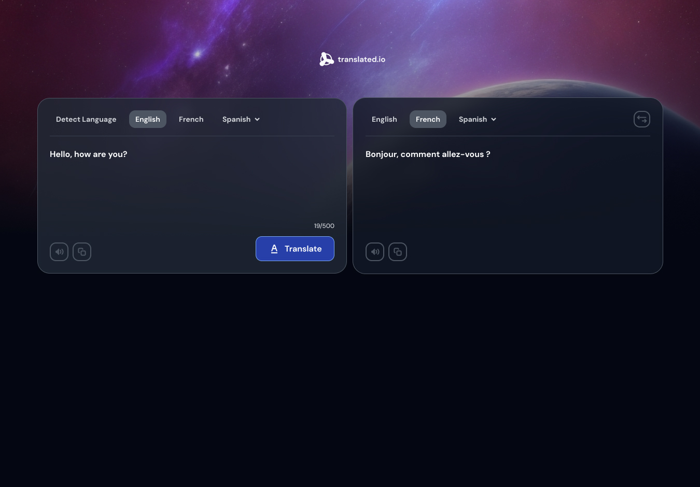

<h1 align="center">Translate App | devChallenges</h1>

   Solution for a challenge <a href="https://devchallenges.io/challenge/translate-app" target="_blank">Translate app</a> from <a href="http://devchallenges.io" target="_blank">devChallenges.io</a>.

<!-- TABLE OF CONTENTS -->

## Table of Contents

- [Overview](#overview)
- [Built with](#built-with)
- [Features](#features)

<!-- OVERVIEW -->

## Overview

### Built with

- Semantic HTML5 markup
- Flexbox
- [React](https://reactjs.org/)

## Features

- Supports 64 languages
- Swap source and target languages
- Listen to input and translated text
- Copy input and translated text
- Supports up to 500 characters per translation